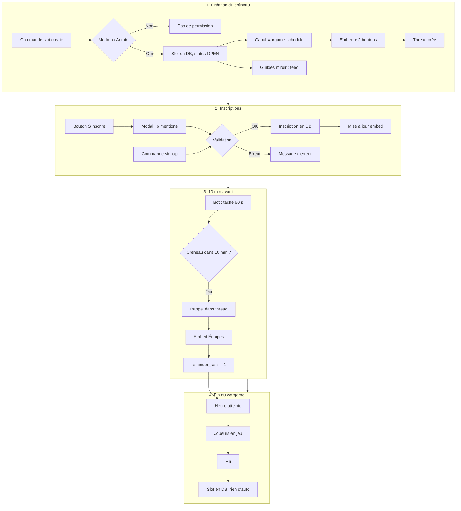
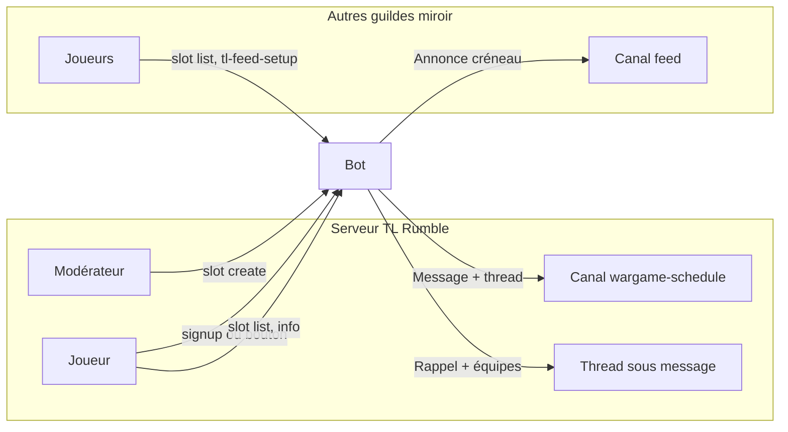

# Schéma logique – Du créneau à la fin du wargame

Ce document décrit le **flux complet** sur Discord et dans le bot : création d’un créneau, inscriptions, rappel, équipes, fin du wargame.

---

## 1. Vue d’ensemble du flux

---

## 2. Détail par phase

### Phase 1 – Création du créneau

| Étape | Acteur | Action | Résultat |
|-------|--------|--------|----------|
| 1.1 | **Modérateur / Admin** | `/slot create` avec date (YYYY-MM-DD), heure (HH:mm), optionnel max_groups | Commande exécutée sur le **serveur principal TL Rumble** uniquement. |
| 1.2 | **Bot** | Vérifie rôle Moderator ou Administrator | Si non : message éphémère « Pas la permission ». |
| 1.3 | **Bot** | Interprète date/heure en **timezone serveur** (ex. Europe/Paris), convertit en UTC, enregistre en DB | Table `slots` : `datetime_utc`, `status = OPEN`, `max_groups`. |
| 1.4 | **Bot** | Si `WARGAME_SCHEDULE_CHANNEL_ID` configuré : envoie un **message** dans ce canal | Embed (date/heure, 0/X groupes, statut OPEN, ID créneau) + **2 boutons** : « S'inscrire avec mon groupe », « Voir les inscrits ». |
| 1.5 | **Bot** | Crée un **thread** sous ce message | Nom du thread : « Wargame [date/heure locale] ». Enregistre `schedule_message_id` et `schedule_thread_id` en DB. |
| 1.6 | **Bot** | Envoie un message dans les **canaux feed** des autres guildes (si configurés via `/tl-feed-setup`) | Embed simplifié « Nouveau wargame planifié », lien vers TL Rumble pour s’inscrire. |

**Commandes liées :**  
- `/slot list` : affiche tous les créneaux (date, statut, X/Y groupes, ID).  
- `/slot info <id>` : détail d’un créneau + liste des groupes inscrits.

---

### Phase 2 – Inscriptions

Deux façons de s’inscrire :

| Voie | Acteur | Action | Résultat |
|------|--------|--------|----------|
| **Bouton** | Joueur (rôle Wargame Player) | Clic sur « S'inscrire » sur le message du créneau | Ouverture d’un **modal** : un champ pour coller les **6 mentions** (@Joueur1 … @Joueur6, lui inclus). |
| **Commande** | Joueur | `/signup` avec option `slot` (ID) + `player1` … `player6` (6 utilisateurs) | Même validation et enregistrement que le modal. |

**Validation (bot) :**  
- Créneau existe, status = OPEN, pas complet.  
- 6 joueurs distincts, l’auteur fait partie des 6.  
- Tous membres du serveur principal.  
- Aucun des 6 déjà inscrit sur ce créneau.

**Après inscription :**  
- Une ligne est ajoutée en DB (`registrations` : slot_id, registrant_id, group_display_name, player1_id…player6_id).  
- Le **message schedule** du créneau est **édité** : embed mis à jour (compteur X/16 groupes, liste des noms de groupes).  
- Le bouton « S'inscrire » est désactivé si le slot passe en CLOSED (non géré par une commande pour l’instant, mais le code le prévoit).

**Bouton « Voir les inscrits » :**  
- Affiche en **éphémère** la liste des groupes inscrits pour ce créneau (sans passer par une commande).

---

### Phase 3 – 10 minutes avant le wargame

| Étape | Acteur | Action | Résultat |
|-------|--------|--------|----------|
| 3.1 | **Bot** | Tâche périodique **toutes les 60 secondes** (depuis `ready`) | Appel à `getSlotsForReminder()` : slots dont `datetime_utc` est entre *maintenant* et *dans 10 min*, et `reminder_sent = 0`. |
| 3.2 | **Bot** | Pour chaque slot trouvé : envoie un message **rappele** | « ⏰ Rappel : le wargame est dans 10 minutes ([date/heure]). Préparez-vous ! » Envoyé dans le **thread** du slot si existant, sinon dans le canal schedule. |
| 3.3 | **Bot** | Envoie l’**embed Équipes** dans le même thread | Répartition des groupes inscrits en 2 équipes (1ère moitié = Équipe 1, 2e moitié = Équipe 2). Titre «️ Équipes – Wargame [date/heure] ». |
| 3.4 | **Bot** | Met à jour le slot en DB | `reminder_sent = 1` pour ne plus rappeler ce créneau. |

---

### Phase 4 – Heure du wargame et après

| Étape | Acteur | Action | Résultat |
|-------|--------|--------|----------|
| 4.1 | **Joueurs** | Connexion au jeu, coordination (vocal, etc.) | Hors bot : les joueurs s’organisent à partir du thread et de l’embed Équipes. |
| 4.2 | **Joueurs** | Wargame en jeu | Fin du flux côté bot. |
| 4.3 | **Bot** | Aucune action automatique à l’heure du wargame ni après | Le slot reste en DB avec `reminder_sent = 1`. Les messages et le thread restent visibles pour l’historique. |

*(Idée d’évolution : message « GG, wargame terminé » après l’heure, ou commande pour fermer/archiver un slot.)*

---

## 3. Schéma des acteurs et des canaux

---

## 4. Récapitulatif des commandes

| Commande | Qui | Où | Rôle |
|----------|-----|----|------|
| `/slot create` | Modo / Admin | Serveur principal uniquement | Crée un créneau, envoie le message schedule + thread, notifie les guildes feed. |
| `/slot list` | Tous | Partout | Liste tous les créneaux (ID, date, statut, inscriptions). |
| `/slot info <id>` | Tous | Partout | Détail d’un créneau + liste des groupes inscrits. |
| `/signup` | Wargame Player / Admin | Serveur principal pour s’inscrire | Inscription avec slot (ID) + 6 joueurs. |
| Bouton **S'inscrire** | Wargame Player / Admin | Serveur principal | Ouvre le modal (6 mentions) puis enregistre l’inscription. |
| Bouton **Voir les inscrits** | Tous | Partout | Affiche en éphémère la liste des groupes du créneau. |
| `/tl-feed-setup` | Admin de la guilde | Guildes miroir | Lie un canal de la guilde pour recevoir les annonces de nouveaux créneaux. |

---

## 5. Données en base (résumé)

| Table | Rôle dans le flux |
|-------|-------------------|
| **slots** | Un enregistrement par créneau : `datetime_utc`, `status`, `max_groups`, `schedule_message_id`, `schedule_thread_id`, `reminder_sent`. |
| **registrations** | Une ligne par groupe inscrit : `slot_id`, `registrant_id`, `group_display_name`, `player1_id` … `player6_id`. |
| **guild_feed_channels** | Guildes (hors principale) + canal où envoyer l’annonce des nouveaux créneaux. |

---

*Ce schéma correspond au comportement actuel du bot (création de créneau → inscriptions → rappel 10 min avant → envoi des équipes → fin). Les évolutions (ex. `/slot close`, désinscription, message de fin) peuvent s’y greffer en prolongeant ce flux.*
